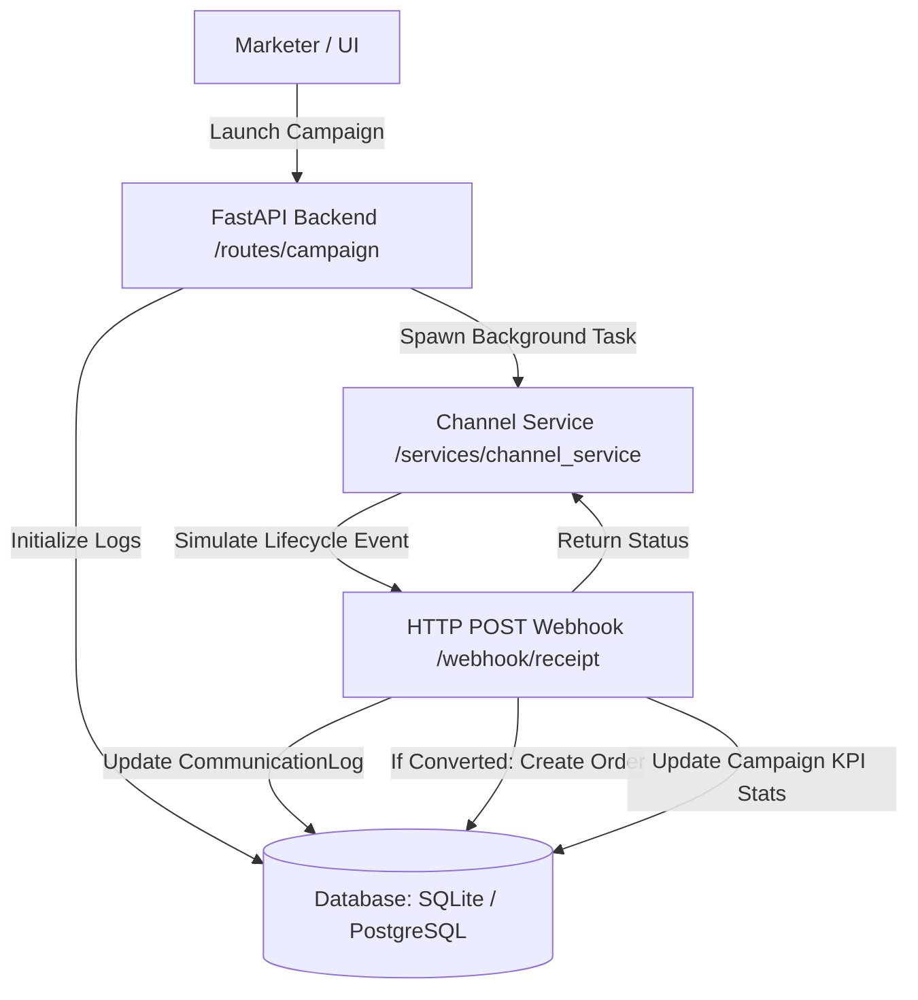

# Xeno CRM - AI-Native Mini CRM

An AI-native CRM built using FastAPI, SQLite (for local development) / Neon Serverless PostgreSQL (for production), and Google Gemini. Designed to help retail brands intelligently segment customer profiles, generate personalized marketing messages, track communication delivery lifecycles, and attribute conversions.

This project is built to satisfy the requirements of the **Xeno Engineering Take-Home Assignment**.

## Key Features

1. **Shopper Ingestion & Order Storage**
   - Import customer and order histories via CSV uploads.
   - Edit profiles and inspect purchase habits.
2. **AI-Powered Customer Segmentation**
   - Marketers can query customer cohorts using natural language prompts (e.g., `"customers from Pune who spent more than 5000"`).
   - Powered by Gemini, which automatically parses conditions and returns matching shoppers.
3. **Decoupled Asynchronous Channel Service & Callback Loop**
   - Simulated message dispatching to external services (Email, SMS, WhatsApp, RCS).
   - Simulates the full lifecycle asynchronously: Sent ➔ Delivered/Failed ➔ Opened ➔ Clicked ➔ Converted.
   - Built with **resilient backoff retries** for webhook HTTP posts back to `/webhook/receipt`.
4. **Order Conversion & Attribution**
   - Automatically tracks order conversions resulting from campaigns.
   - Calculates real-time Click-Through Rate (CTR), Conversion Rate (CVR), and total Campaign Revenue.
5. **Customer Timeline History**
   - Displays both customer purchase timelines and communication logs side-by-side on profiles.

---

## Directory Structure

```
├── app.py                     # Main application entry point & setup
├── database.py                # Database engine & session configuration (loads environment url)
├── model.py                   # SQLAlchemy schema models (Customer, Order, Campaign, CommunicationLog)
├── seed.py                    # DB seed script for mock data
├── requirements.txt           # Python application dependencies
├── routes/
│   ├── ai.py                  # AI segment generation endpoint
│   ├── analytics.py           # Campaign performance UI route
│   ├── campaign.py            # Campaign CRUD and launch handler
│   ├── customer.py            # Customer CRUD and profile view
│   ├── dashboard.py           # Dashboard overview and KPI metrics
│   ├── order.py               # Order CRUD and CSV ingestion
│   ├── segment.py             # Custom Segment views
│   └── webhook.py             # Webhook callback receipt endpoint
├── services/
│   ├── ai_service.py          # Gemini AI integration for segmentation and personas
│   ├── channel_service.py     # Asynchronous message delivery simulation
│   └── segment_service.py     # Database filters for customer segments
├── templates/                 # Jinja2 frontend template layouts
└── static/                    # CSS stylesheets and client JS files
```

---

## Setup & Local Running Instructions

### 1. Prerequisites
- Python 3.8 or higher.
- A Gemini API Key (set in a `.env` file).

### 2. Installation
Clone the repository and install the dependencies:
```bash
pip install -r requirements.txt
```

### 3. Environment Variables
Create a `.env` file in the root directory:
```env
GEMINI_API_KEY=your_gemini_api_key_here
DATABASE_URL=sqlite:///./crm.db
```
*(Leave `DATABASE_URL` as SQLite for local dev, or supply a PostgreSQL connection string to point to your cloud database).*

### 4. Database Setup
Initialize and seed the database with testing data:
```bash
python seed.py
```

### 5. Launch the Application
Start the Uvicorn web server:
```bash
python -m uvicorn app:app --port 8000 --reload
```
Open [http://127.0.0.1:8000](http://127.0.0.1:8000) in your web browser.

---

## System Architecture


